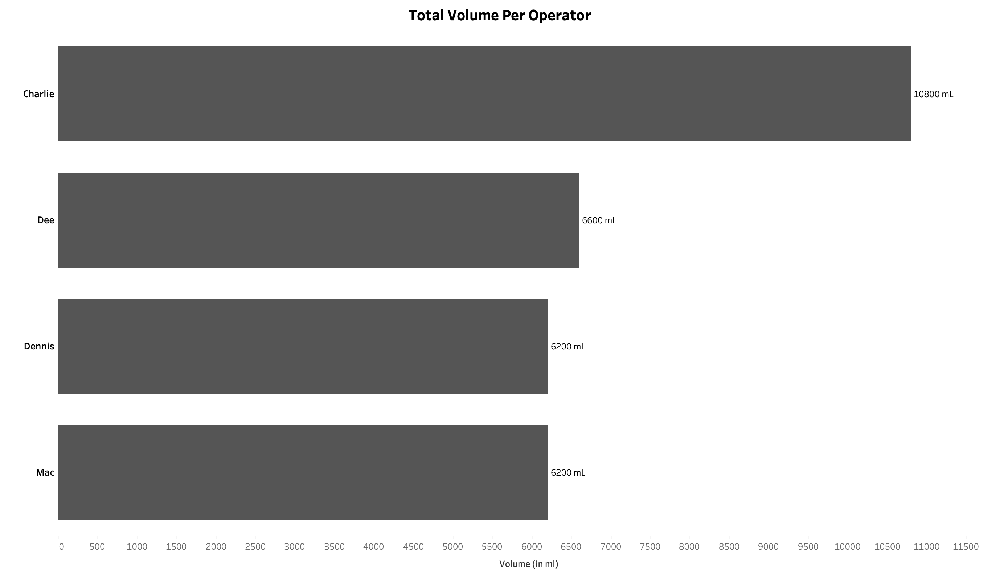
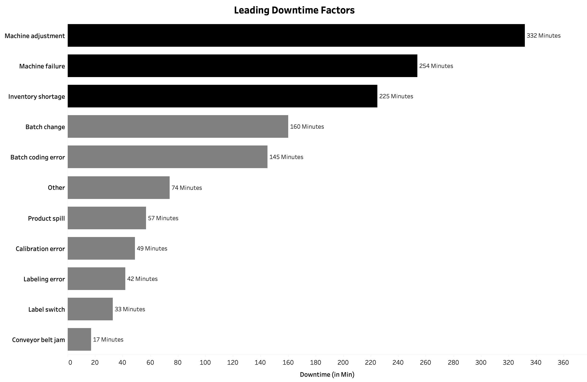
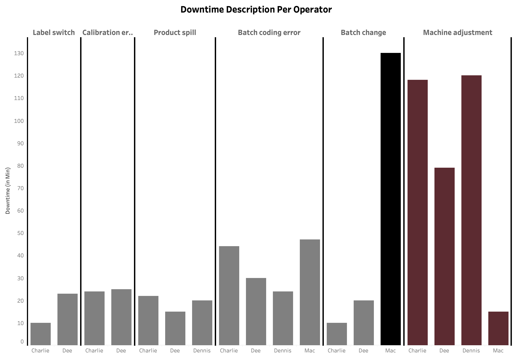

# Executive Summary

This analysis of Ignition’s manufacturing plant reveals a plant efficiency rate of **65.98%**. The top operator was **Charlie**, who produced the most amount of soda at **10,800 mL** and had an efficiency rate of **70.97%**. **Dennis** and **Mac** showcased a lower efficiency with very high operator error rates, and only produced **6200 mL** each of soda. The analysis further breaks down the reasons for Dennis and Mac’s poor performances. It also reveals insights on factors that caused the most downtime over the week and provides recommendations to make the plant more efficient.

## Insights Deep Dive

### Line Efficiency

To calculate Line Efficiency, the formula used was:
(Minimum Time / Total Time Taken) * 100

This ensures that if the batch was done in the least amount of time possible, the efficiency would be **100%**. The Line Efficiency for the entire week was **65.98%**. This metric should be compared with the efficiency rate from other weeks to determine the full context.

### Underperforming Operators

#### Operator Efficiency

| Operator | Efficiency Rate |
| -------- | --------------- |
| Charlie  | 70.97%          |
| Dee      | 66.81%          |
| Dennis   | 65.91%          |
| Mac      | 58.06%          |

*Note: This table does not factor in operator error, and due to the small sample size, executive decisions should not rely on this data alone.*

#### Operator Error Rate (Downtime per Expected Minute Worked)

| Operator | Error Rate |
| -------- | ---------- |
| Mac      | 0.42       |
| Dennis   | 0.38       |
| Charlie  | 0.37       |
| Dee      | 0.32       |

*Mac has a very high error rate, indicating concerns. Management should consider providing further training and assistance.*

#### Operator Volume Produced

| Operator | Volume Produced |
| -------- | --------------- |
| Charlie  | 10,800 mL       |
| Dee      | 6600 mL         |
| Mac      | 6200 mL         |
| Dennis   | 6200 mL         |

*Charlie has had a very productive week, producing 10,800 mL of soda, while Mac and Dennis were tied for the least amount of volume produced at 6200 mL.*

### Leading Downtime Factors

The top 3 leading downtime factors were:
- **Machine Adjustment:** 332 minutes
- **Machine Failure:** 254 minutes
- **Inventory Shortage:** 225 minutes

*Recommendations are provided at the end of this proposal for further suggestions on how to reduce downtime at the plant.*

### Downtime Analysis by Product Flavor

The metric used here was downtime in minutes caused per mL of product produced.

| Product Flavor | Downtime (Min per 1 mL) |
| -------------- | ----------------------- |
| Orange         | 0.06                    |
| Lemon Lime     | 0.04                    |
| Root Beer      | 0.04                    |
| Diet Cola      | 0.04                    |
| Cola           | 0.02                    |

*Orange flavor causes significantly more downtime for each mL produced. Management should consider further analysis to understand this discrepancy.*

### Operator Struggles

An analysis of each operator’s downtime factor that contributed the most downtime is provided below:

| Operator | Description         | Downtime |
| -------- | ------------------- | -------- |
| Mac      | Batch Change        | 130 min  |
| Dennis   | Machine Adjustment  | 120 min  |
| Charlie  | Machine Adjustment  | 118 min  |
| Dee      | Machine Adjustment  | 79 min   |
*Mac struggles with Batch Change (130 minutes of downtime), while the rest of the operators primarily struggle with Machine Adjustment. Management should consider improved training or alternative methods to make machine adjustments more efficient.*

## Recommendations

### Implement Standardized Machine Adjustment Procedures
- Develop step-by-step guidelines for machine adjustments.
- Create visual aids and checklists for common adjustment scenarios.
- Consider implementing a buddy system where high-performing operators mentor others.

### Enhanced Operator Training Program
- Prioritize batch change training for Mac to address his specific challenge.
- Implement cross-training sessions led by Charlie to share best practices.
- Develop specialized training modules for orange flavor production.

### Equipment and Inventory Management
- Conduct preventive maintenance checks to reduce machine failures.
- Implement an inventory management system to prevent shortages.
- Consider automated alerts for low inventory levels.

### Performance Monitoring System
- Establish weekly performance reviews with operators.
- Set individual improvement targets based on historical data.
- Create a reward system for achieving efficiency targets.

### Process Optimization
- Review and optimize the orange flavor production line.
- Analyze Charlie's workflow to identify best practices.
- Consider scheduling high-performing operators during critical production runs.

